# Tài liệu Dự án: Badminton Shop Frontend

## Tổng quan dự án

Đây là ứng dụng **web bán cầu lông** (e-commerce) xây dựng bằng React 19, bao gồm:
- **Phía khách hàng**: Duyệt sản phẩm, giỏ hàng, thanh toán, quản lý tài khoản
- **Phía quản trị (Admin)**: Quản lý sản phẩm, đơn hàng, người dùng, analytics

---

## Kiến trúc tổng quan

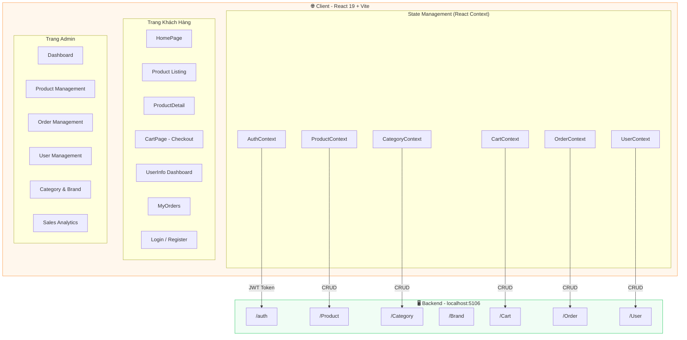

---

## Cấu trúc thư mục

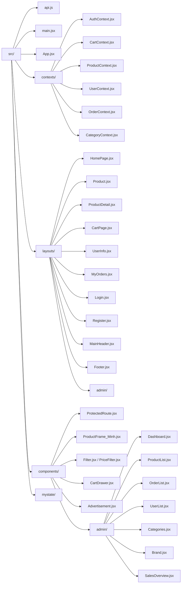

---

## Luồng dữ liệu & Authentication

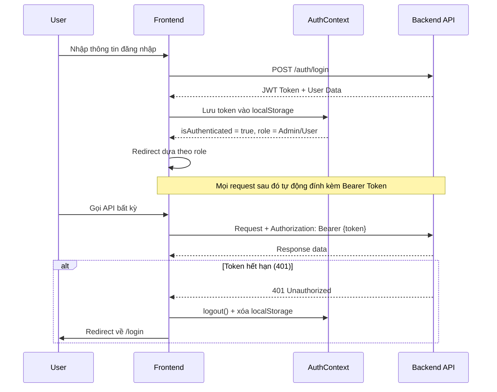

---

## Phân công công việc cho 3 thành viên

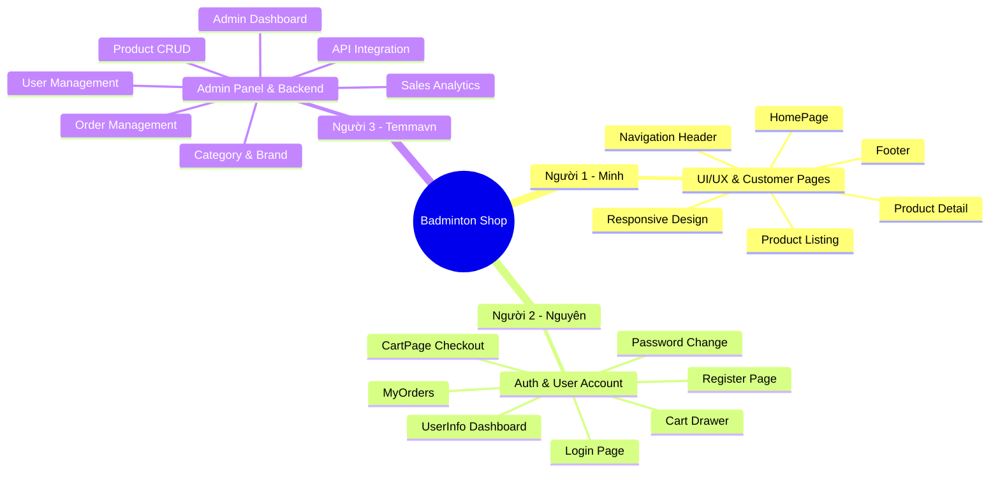

---

## Chi tiết công việc từng người

---

### 👤 Người 1 — UI/UX & Customer Pages

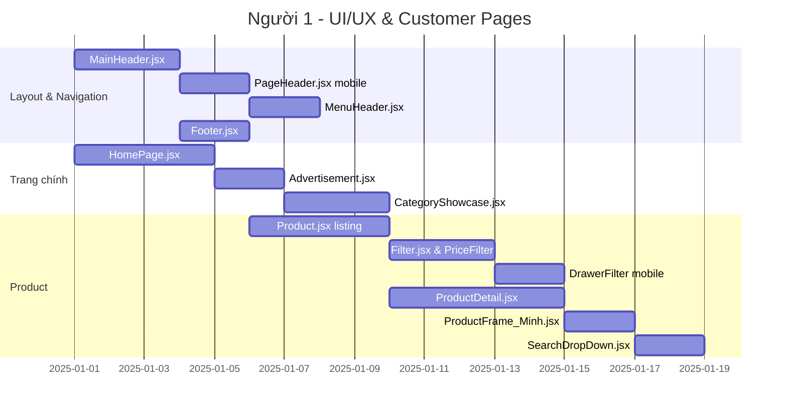

**File phụ trách:**
```mermaid
graph TD
    P1[👤 Người 1]
    P1 --> L1[layouts/HomePage.jsx]
    P1 --> L2[layouts/Product.jsx]
    P1 --> L3[layouts/ProductDetail.jsx]
    P1 --> L4[layouts/MainHeader.jsx]
    P1 --> L5[layouts/PageHeader.jsx]
    P1 --> L6[layouts/MenuHeader.jsx]
    P1 --> L7[layouts/Footer.jsx]
    P1 --> C1[components/Advertisement.jsx]
    P1 --> C2[components/CategoryShowcase.jsx]
    P1 --> C3[components/ProductFrame_Minh.jsx]
    P1 --> C4[components/Filter.jsx]
    P1 --> C5[components/PriceFilter.jsx]
    P1 --> C6[components/DrawerFilter.jsx]
    P1 --> C7[components/SearchDropDown.jsx]
    P1 --> C8[components/ProductCategory.jsx]
    P1 --> CTX[contexts/ProductContext.jsx - đọc dữ liệu]

    style P1 fill:#3b82f6,color:#fff
    style CTX fill:#fef9c3,stroke:#ca8a04
```

**Nhiệm vụ cụ thể:**

| STT | Công việc | File | Mô tả |
|-----|-----------|------|-------|
| 1 | Header điều hướng | `layouts/MainHeader.jsx` | Logo, search bar, cart icon, user menu |
| 2 | Header mobile | `layouts/PageHeader.jsx` | Hamburger menu, responsive nav |
| 3 | Trang chủ | `layouts/HomePage.jsx` | Banner carousel, category showcase, animation |
| 4 | Banner quảng cáo | `components/Advertisement.jsx` | Swiper carousel |
| 5 | Danh sách sản phẩm | `layouts/Product.jsx` | Grid sản phẩm, phân trang |
| 6 | Bộ lọc giá | `components/PriceFilter.jsx` | Slider lọc giá (Radix UI) |
| 7 | Drawer filter mobile | `components/DrawerFilter.jsx` | Bộ lọc trên điện thoại |
| 8 | Chi tiết sản phẩm | `layouts/ProductDetail.jsx` | Gallery ảnh, chọn variant, tabs |
| 9 | Card sản phẩm | `components/ProductFrame_Minh.jsx` | Hiển thị card trong danh sách |
| 10 | Search dropdown | `components/SearchDropDown.jsx` | Gợi ý tìm kiếm realtime |
| 11 | Footer | `layouts/Footer.jsx` | Links, contact info |
| 12 | Responsive design | Toàn bộ component phụ trách | Kiểm tra trên mobile/tablet |

---

### 👤 Người 2 — Authentication & User Account

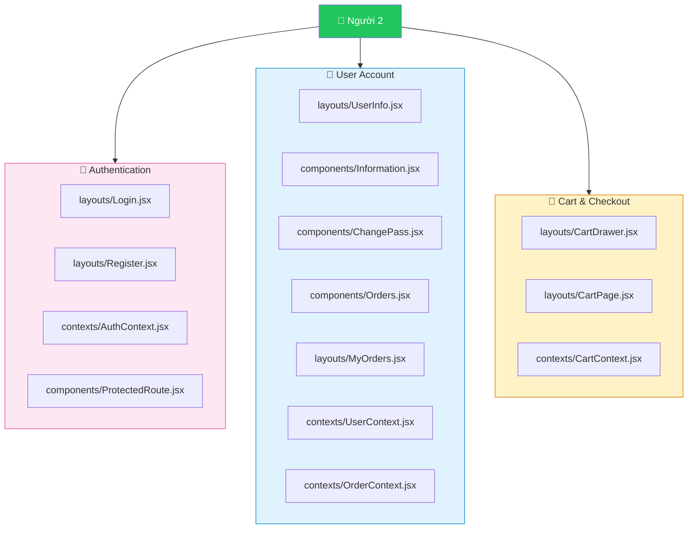

**Nhiệm vụ cụ thể:**

| STT | Công việc | File | Mô tả |
|-----|-----------|------|-------|
| 1 | Trang đăng nhập | `layouts/Login.jsx` | Form login, validation |
| 2 | Trang đăng ký | `layouts/Register.jsx` | Form đăng ký, validation |
| 3 | Context xác thực | `contexts/AuthContext.jsx` | JWT, login/logout, role check |
| 4 | Route bảo vệ | `components/ProtectedRoute.jsx` | Guard auth + admin-only |
| 5 | Dashboard tài khoản | `layouts/UserInfo.jsx` | Tab profile / password / orders |
| 6 | Form thông tin cá nhân | `components/Information.jsx` | Chỉnh sửa tên, SĐT, địa chỉ |
| 7 | Đổi mật khẩu | `components/ChangePass.jsx` | Form đổi pass với validation |
| 8 | Context user | `contexts/UserContext.jsx` | Fetch/update profile |
| 9 | Lịch sử đơn hàng | `layouts/MyOrders.jsx` + `components/Orders.jsx` | Danh sách orders, badge status |
| 10 | Context đơn hàng | `contexts/OrderContext.jsx` | Fetch orders, cancel order |
| 11 | Giỏ hàng (drawer) | `layouts/CartDrawer.jsx` | Sidebar cart, cập nhật số lượng |
| 12 | Trang thanh toán | `layouts/CartPage.jsx` | 2 bước: địa chỉ → thanh toán |
| 13 | Context giỏ hàng | `contexts/CartContext.jsx` | Add/update/delete cart items |
| 14 | Input components | `components/MyInput.jsx` `MyCheckBox.jsx` `MyRadio.jsx` | UI controls tái sử dụng |

**Luồng thanh toán (CartPage):**
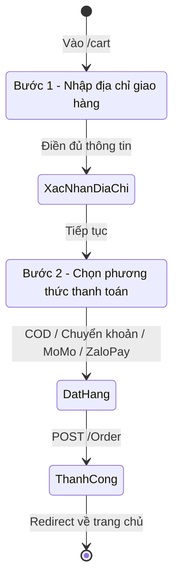

---

### 👤 Người 3 — Admin Panel & API Integration

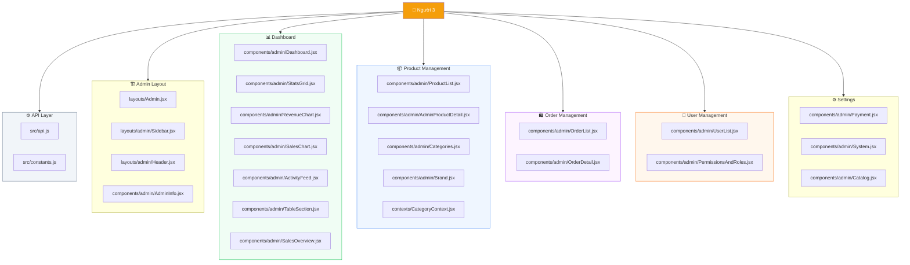

**Nhiệm vụ cụ thể:**

| STT | Công việc | File | Mô tả |
|-----|-----------|------|-------|
| 1 | Cấu hình Axios | `src/api.js` | Interceptor JWT, xử lý lỗi 401 |
| 2 | Layout admin | `layouts/Admin.jsx` | Wrapper layout cho toàn admin |
| 3 | Sidebar điều hướng | `layouts/admin/Sidebar.jsx` | Menu điều hướng admin |
| 4 | Dashboard tổng quan | `components/admin/Dashboard.jsx` | Gọi các widget con |
| 5 | Lưới thống kê | `components/admin/StatsGrid.jsx` | KPI cards (đơn hàng, doanh thu...) |
| 6 | Biểu đồ doanh thu | `components/admin/RevenueChart.jsx` | Recharts line/bar chart |
| 7 | Biểu đồ bán hàng | `components/admin/SalesChart.jsx` | Sales metrics graph |
| 8 | Nhật ký hoạt động | `components/admin/ActivityFeed.jsx` | Recent activity log |
| 9 | Bảng đơn hàng gần đây | `components/admin/TableSection.jsx` | Recent orders widget |
| 10 | Tổng quan bán hàng | `components/admin/SalesOverview.jsx` | Analytics page |
| 11 | Danh sách sản phẩm | `components/admin/ProductList.jsx` | Bảng CRUD sản phẩm |
| 12 | Chỉnh sửa sản phẩm | `components/admin/AdminProductDetail.jsx` | Form tạo/sửa sản phẩm, variants |
| 13 | Quản lý danh mục | `components/admin/Categories.jsx` | CRUD categories |
| 14 | Context danh mục | `contexts/CategoryContext.jsx` | State cho categories |
| 15 | Quản lý thương hiệu | `components/admin/Brand.jsx` | CRUD brands |
| 16 | Danh sách đơn hàng | `components/admin/OrderList.jsx` | Bảng orders, lọc theo status |
| 17 | Chi tiết đơn hàng | `components/admin/OrderDetail.jsx` | Xem + cập nhật trạng thái |
| 18 | Danh sách người dùng | `components/admin/UserList.jsx` | Quản lý accounts |
| 19 | Phân quyền | `components/admin/PermissionsAndRoles.jsx` | Role management |
| 20 | Cấu hình thanh toán | `components/admin/Payment.jsx` | Cài đặt phương thức thanh toán |

---

## Luồng routing toàn ứng dụng

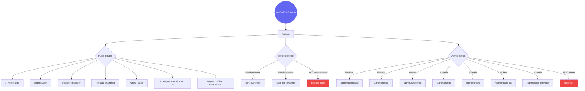

---

## API Endpoints theo nhóm

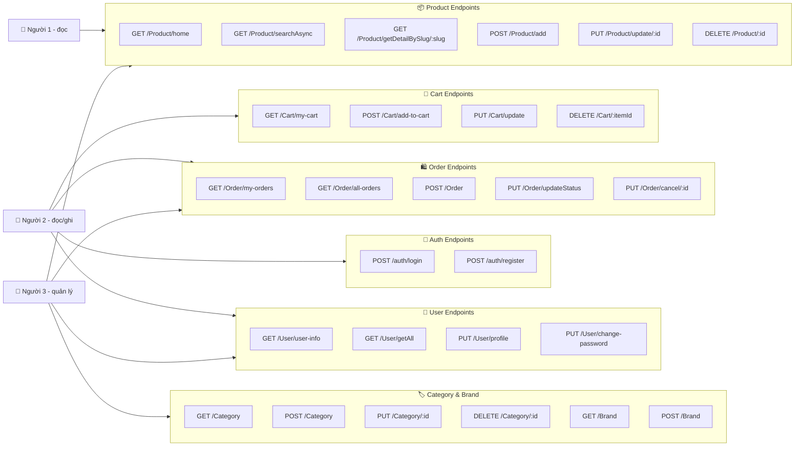

---

## Tóm tắt phân công

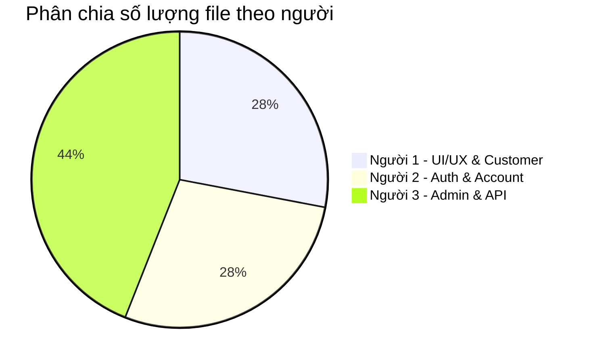

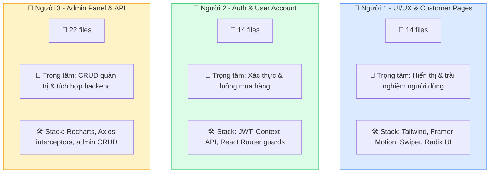

---

## Tech Stack

| Công nghệ | Phiên bản | Mục đích |
|-----------|-----------|---------|
| React | 19.2.0 | UI Framework |
| React Router DOM | 7.14.0 | Client-side routing |
| Axios | 1.15.0 | HTTP client + JWT interceptor |
| Tailwind CSS | 4.2.1 | Utility-first styling |
| DaisyUI | 5.5.19 | Component library |
| Framer Motion | 12.35.1 | Animations |
| Recharts | 3.8.1 | Charts & graphs |
| Swiper | 12.1.2 | Carousel/slider |
| jwt-decode | 4.0.0 | Parse JWT tokens |
| Lucide React | 0.577.0 | Icons |
| Radix UI Slider | 1.3.6 | Price range slider |
| Vite | 7.3.1 | Build tool |

---

*Tài liệu tạo ngày 2026-05-11*
